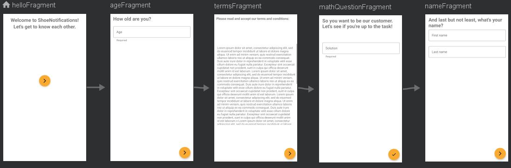

# postpc-2021-ex9: ShoeNotifications

An android app demonstrating a basic on-boarding process.

## Project Structure

In the main package, we have 2 activities:
* MainActivity.kt : If the user has not finished the on-boarding process, the OnboardingActivity will be launched; else the PostOnboardingActivity is launched.
* PostOnboardingActivity.kt : Once the user has finished the process, he will always see this activity with a "more to come" prompt message.
The main package also has the custom Application class which saves to SharedPrefences whether the user has finished the process or not, and this
value is used to determine which activity will be launched from MainActivity.

The other package is the 'onboarding' package, which consists of an activity, a view-model and 5 sub-packages:
* OnboardingActivity: the activity that contains all the on-boarding fragments. This activity shows the user progress so far in the process.
* OnboardingViewModel: a view model shared by the activity and all the contained fragments to store the progress and the status of the on-boarding process.

The 5 sub packages are:
* hello: contains a fragment that starts the process.
* age: contains a fragment that receives user age and a view model that store that age and validate it's requirements.
* terms: a fragment and a view-model that shows the user a 'Terms & Conditions' text. User will have to scroll (read) to the bottom of the text to be able to continue.
* math : a data class for a simple binary math question, a view-model for creating questions and validating their answers, and a fragment to show this info.
* name : a fragment and a view model that receives user's first and last names and validates them. Finishing this fragment will mark the process as 'finished' and from
that moment the user will (always) see the PostOnboardingActivity.

The navigation graph is as follows:

 

The user can return to previous fragments using android's BACK button, and all previous information will stay intact thanks to View-Model.
Each layout also has a 'landscape' mode.

## Android components and libraries used

* Fragments
* Navigation
* View-Model
* LiveData
* MVVM Architecture
* Material Design Components

## Academic Integrity
I pledge the highest level of ethical principles in support of academic excellence.  
I ensure that all of my work reflects my own abilities and not those of someone else.
